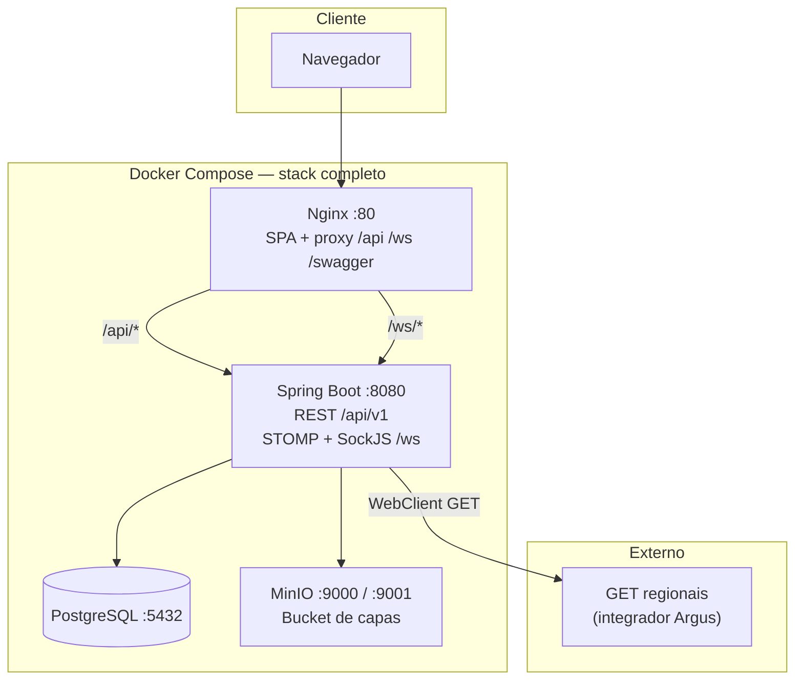

# Artistas e Álbuns — Full Stack

Monorepo com **API Java (Spring Boot 3.2, JDK 21)** e **SPA React (TypeScript, Vite 8, Tailwind 4)**. Infraestrutura padrão: **PostgreSQL 15**, **MinIO** (S3-compatible), opcionalmente **Nginx** no stack completo via Docker Compose.

---

## Índice

1. [Origem e referências](#1-origem-e-referências)
2. [Pré-requisitos](#2-pré-requisitos)
3. [Instalação de dependências](#3-instalação-de-dependências)
4. [Inicialização — stack completo (Docker)](#4-inicialização--stack-completo-docker)
5. [Inicialização — apenas PostgreSQL e MinIO (Docker) + dev local](#5-inicialização--apenas-postgresql-e-minio-docker--dev-local)
6. [Variáveis de ambiente e perfis](#6-variáveis-de-ambiente-e-perfis)
7. [Arquitetura do sistema](#7-arquitetura-do-sistema)
8. [Estrutura de pastas e decisões](#8-estrutura-de-pastas-e-decisões)
9. [Padrões de projeto (backend)](#9-padrões-de-projeto-backend)
10. [API externa de regionais (Argus / integrador)](#10-api-externa-de-regionais-argus--integrador)
11. [Jornada do usuário (testes manuais)](#11-jornada-do-usuário-testes-manuais)
12. [Frontend — arquitetura, bibliotecas e padrões](#12-frontend--arquitetura-bibliotecas-e-padrões)
13. [Testes e build](#13-testes-e-build)
14. [Referências técnicas](#14-referências-técnicas)

---

## 1. Origem e referências

Este repositório implementa o cenário descrito no material de **processo seletivo** (ANEXO II-C — artistas e álbuns), utilizado como base de estudo e portfólio.

- **Referência ao edital / página do processo**: [Processo seletivo conjunto nº 001/2026 — SEPLAG e demais órgãos (Engenheiro da Computação Sênior)](https://seletivo.seplag.mt.gov.br/detalhes/43?slug=processo-seletivo-conjunto-no-0012026seplag-e-demais-orgaos-engenheiro-da-computacao-senior)  
  *Nota: o site pode responder com bloqueio de WAF (“Request Rejected”) dependendo da rede; o link permanece como referência institucional ao edital.*

**Esclarecimento:** o mantenedor deste repositório **não foi candidato** ao certame; o código foi organizado a partir do enunciado/projeto disponibilizado para fins de aprendizado e documentação.

---

## 2. Pré-requisitos

| Ferramenta | Uso |
|------------|-----|
| **Docker** + **Docker Compose** | Subir banco, MinIO e/ou stack inteiro |
| **JDK 21** + **Maven 3.9+** | Backend fora do container |
| **Node.js 20+** (recomendado) + **npm** | Frontend fora do container |

---

## 3. Instalação de dependências

Na **raiz** do repositório (`artistas-fullstack/`):

### Backend

```bash
cd backend
mvn -q -DskipTests dependency:go-offline
```

Ou, para compilar e baixar dependências de teste:

```bash
cd backend && mvn -q test-compile
```

### Frontend

```bash
cd frontend
npm ci
```

Se não existir `package-lock.json` no seu clone, use `npm install` uma vez para gerá-lo e depois prefira `npm ci` em ambientes reproduzíveis.

---

## 4. Inicialização — stack completo (Docker)

Na raiz do repositório:

```bash
docker compose up --build
```

### Serviços definidos em `docker-compose.yml`

| Serviço | Container | Porta(s) | Função |
|---------|-----------|----------|--------|
| `db` | `artistas-db` | **5432** | PostgreSQL |
| `minio` | `artistas-minio` | **9000** (API S3), **9001** (console) | Armazenamento de capas |
| `api` | `artistas-api` | **8080** | Spring Boot |
| `web` | `artistas-web` | **80** | Nginx servindo o build estático + proxy |

### URLs úteis (stack completo)

- **Aplicação (Nginx + SPA)**: [http://localhost](http://localhost) — proxy de `/api` e `/ws` para a API (`frontend/nginx.conf`).
- **API direta**: [http://localhost:8080](http://localhost:8080)
- **Swagger UI**: [http://localhost:8080/swagger-ui.html](http://localhost:8080/swagger-ui.html) (também repassado pelo Nginx nas rotas `/swagger-ui.html`, `/swagger-ui/`, `/v3/`)
- **MinIO Console**: [http://localhost:9001](http://localhost:9001)
- **Health (Actuator)**: `GET http://localhost:8080/actuator/health`

### Credenciais padrão da aplicação (seed)

Definidas em `backend/src/main/java/com/artistas/api/bootstrap/AdminUserInitializer.java` na primeira subida com banco vazio:

- **Usuário:** `admin`
- **Senha:** `admin123`

### Credenciais padrão do Compose (sobrescrevíveis por `.env`)

- **PostgreSQL:** usuário / senha / banco `artistas` (variáveis `POSTGRES_*` no compose).
- **MinIO:** `minio` / `minio12345` (`MINIO_ROOT_USER` / `MINIO_ROOT_PASSWORD`).

---

## 5. Inicialização — apenas PostgreSQL e MinIO (Docker) + dev local

Fluxo recomendado quando você desenvolve **API e front na máquina**, mas quer banco e objeto storage isolados em containers.

### 1) Subir só `db` e `minio`

Na raiz:

```bash
docker compose up -d db minio
```

Aguarde o healthcheck do Postgres (`pg_isready` no serviço `db`).

### 2) Backend com perfil `local`

O perfil **`local`** ajusta o endpoint S3 para o host (`127.0.0.1:9000`), pois a API **não** resolve o hostname Docker `minio` quando roda fora da rede do compose. Também **desliga o rate limit** para não atrapalhar o HMR e múltiplas requisições em dev (`application-local.yml`).

```bash
cd backend
mvn spring-boot:run -Dspring-boot.run.arguments=--spring.profiles.active=local
```

Requer **JDK 21** e **Maven**. Alinhe `S3_ACCESS_KEY` / `S3_SECRET_KEY` ao que estiver no compose se alterar `MINIO_ROOT_*`.

### 3) Frontend (Vite)

```bash
cd frontend
npm run dev
```

O `vite.config.ts` faz proxy de **`/api`** e **`/ws`** para `http://localhost:8080`.

- Interface dev: tipicamente [http://localhost:5173](http://localhost:5173)
- Faça login na **mesma origem** em que usa o app (JWT + `sessionStorage` — ver `AuthFacade.ts`).

---

## 6. Variáveis de ambiente e perfis

Principais propriedades (ver `backend/src/main/resources/application.yml` e `application-local.yml`):

| Área | Propriedade / env | Descrição |
|------|-------------------|-----------|
| Banco | `DB_HOST`, `DB_PORT`, `DB_NAME`, `DB_USER`, `DB_PASSWORD` | JDBC PostgreSQL |
| JWT | `JWT_SECRET`, `JWT_ACCESS_MINUTES`, `JWT_REFRESH_DAYS` | HS256; access token curto (padrão 5 min) |
| S3 / MinIO | `S3_ENDPOINT`, `S3_ACCESS_KEY`, `S3_SECRET_KEY`, `S3_BUCKET`, `S3_REGION`, `S3_PRESIGN_MINUTES` | Upload e URLs pré-assinadas de leitura |
| Argus | `ARGUS_REGIONAIS_URL` | URL da API externa de regionais (default no YAML) |
| Rate limit | `RATE_LIMIT_ENABLED`, `RATE_LIMIT_PER_MINUTE` | Filtro com Bucket4j; desligado no perfil `local` |

O `docker-compose.yml` injeta variáveis na serviço `api` (host `db`, endpoint `http://minio:9000`, etc.).

---

## 7. Arquitetura do sistema

Visão em camadas e fluxo de dados (alinhada a `docker-compose.yml`, `SecurityConfig`, `WebSocketConfiguration`, `nginx.conf`).



**Autenticação:** JWT de acesso (curta duração) + refresh token; o front persiste tokens em `sessionStorage` (`AuthFacade.ts`).

**CORS (implementação atual):** em `SecurityConfig`, `allowCredentials(false)` e `allowedOriginPattern("*")` no `CorsConfigurationSource`, com comentários explicando o uso de **Authorization** em vez de cookies cross-site. Há propriedade `app.cors.allowed-origins` em `AppProperties` / `application.yml`, porém **a cadeia de segurança não a utiliza** no `CorsConfigurationSource` atual — documentamos o comportamento efetivo do código.

**Armazenamento de capas:** upload via API para o bucket; leitura por **URLs pré-assinadas** (minutos configuráveis, padrão 30).

**WebSocket:** broker simples com prefixo `/topic`; endpoint SockJS/STOMP em `/ws`; o front assina `/topic/albums` (`useAlbumWebSocket.ts`).

**Rate limit:** `RateLimitingFilter` + Bucket4j (`app.rate-limit.*`); desativado no perfil `local`.

---

## 8. Estrutura de pastas e decisões

### Backend (`backend/src/main/java/com/artistas/api/`)

Separação **em camadas** clássica Spring: entrada HTTP, regras de negócio, persistência e modelo.

```text
com.artistas.api
├── ArtistasApiApplication.java      # Bootstrap Spring Boot
├── bootstrap/                       # Inicialização (ex.: usuário admin)
├── config/                          # Segurança, JWT, S3, WebSocket, OpenAPI, rate limit
├── domain/                          # Entidades JPA (Artist, Album, Regional, …)
├── dto/                             # Contratos de API (request/response), por agregado
├── repository/                      # Spring Data JPA
├── service/                         # Orquestração e regras (Auth, Album, RegionalSync, …)
└── web/                             # Controllers REST + GlobalExceptionHandler
```

**Por quê assim:** `web` permanece fino (HTTP + validação), `service` concentra transações e integrações (`RegionalSyncService` com `WebClient`), `domain` + `repository` isolam persistência, `dto` evita expor entidades e estabiliza o contrato OpenAPI.

Migrações: `backend/src/main/resources/db/migration/` (Flyway, `ddl-auto: validate` em runtime normal).

### Frontend (`frontend/src/`)

Organização por **tipo de artefato**, favorecendo descoberta e testes manuais por rota.

```text
src/
├── api/           # Cliente HTTP compartilhado (Axios + interceptors)
├── components/    # UI reutilizável (carousel de capas, mídia do card, …)
├── facade/        # Fachadas de API + estado RxJS (requisito de clareza de integração)
├── hooks/         # useAuthState, useAlbumWebSocket
├── lib/           # Utilitários (ex.: cn para classes Tailwind)
├── pages/         # Telas mapeadas pelo React Router
├── routes/        # PrivateRoute (guard de autenticação)
├── types/         # Tipos TypeScript alinhados à API
├── App.tsx        # Rotas, shell, lazy loading
└── main.tsx       # Entry + providers globais mínimos
```

**Por quê assim:** páginas ficam localizáveis para QA manual; fachadas encapsulam REST e **observabilidade de estado** (`BehaviorSubject`); hooks isolam efeitos (WebSocket, subscrição à sessão).

---

## 9. Padrões de projeto (backend)

| Padrão / prática | Onde aparece |
|------------------|--------------|
| **Camadas (Layered)** | `web` → `service` → `repository` → `domain` |
| **DTO / Anti-corruption na borda** | Pacote `dto/*` nos controllers |
| **Repository** | Spring Data em `repository/` |
| **Centralized exception handling** | `GlobalExceptionHandler` — ex.: `IllegalStateException` → **502** para falhas de integração externa |
| **Configuration properties** | `AppProperties` + `@ConfigurationProperties(prefix = "app")` |
| **API versionada** | Prefixo `/api/v1` nos controllers |
| **Token bucket (rate limiting)** | `RateLimitingFilter` + Bucket4j |

---

## 10. API externa de regionais (Argus / integrador)

### Papel no sistema

Sincronizar a tabela **`regional`** com uma fonte externa de cadastro de regionais, preservando histórico quando o **nome** muda para o mesmo **código externo** (inativa o registro antigo e cria um novo ativo).

### Configuração

- Propriedade: `app.argus.regionais-url`  
- Variável de ambiente: **`ARGUS_REGIONAIS_URL`**  
- Default em `application.yml`: `https://integrador-argus-api.geia.vip/v1/regionais`

### Chamada HTTP feita pelo backend

- **Método:** `GET`
- **URL:** valor de `regionais-url` (sem query string obrigatória no código).
- **Cliente:** `WebClient` (`RegionalSyncService`).
- **Accept:** `application/json`
- **Corpo:** texto JSON interpretado de forma **tolerante** (ver abaixo).

### Formato JSON aceito no parser

Implementação em `RegionalSyncService.parseRegionaisJson`:

1. Raiz **array** de objetos, **ou**
2. Objeto com propriedade **`data`** (array), **ou**
3. Objeto com propriedade **`content`** (array).

Cada elemento do array é mapeado buscando o primeiro campo útil entre aliases:

| Conceito | Chaves aceitas para código (inteiro) |
|----------|--------------------------------------|
| Identificador | `id`, `codigo`, `codigoRegional`, `regionalId` |
| Nome | `nome`, `descricao`, `nomeRegional`, `denominacao` |

Registros sem código **e** nome válidos são ignorados na lista intermediária.

### Exposição na API própria (autenticado)

`RegionalAdminController` — base path **`/api/v1/admin/regionais`** (JWT obrigatório):

| Método | Caminho | Descrição |
|--------|---------|-----------|
| `POST` | `/sync` | Executa `syncFromArgus()`; retorna contadores (`SyncResult`) |
| `GET` | `/` | Lista regionais **ativas** após sincronização |

### Erros

- Falha de rede / HTTP na API externa: lança `IllegalStateException` → **`502 Bad Gateway`** com mensagem amigável (`GlobalExceptionHandler`).
- JSON inválido ou formato não reconhecido: `IllegalArgumentException` → **400**.

---

## 11. Jornada do usuário (testes manuais)

Use as credenciais **`admin` / `admin123`**. Em dev, prefira uma única origem (`http://localhost:5173` **ou** `http://127.0.0.1:5173`).

1. **Login**  
   - Acessar `/login`, autenticar, ver redirecionamento para a lista de artistas.

2. **Catálogo de artistas**  
   - Na home (`/`), validar paginação, busca por nome e ordenação asc/desc (`GET /api/v1/artists`).

3. **Novo artista**  
   - `/artists/new` — criar artista; conferir retorno à lista ou detalhe.

4. **Detalhe e edição**  
   - Abrir `/artists/:id`; editar em `/artists/:id/edit`.

5. **Álbuns**  
   - Criar álbum (`/albums/new`) vinculado a um artista.  
   - Detalhe `/albums/:id` com capas (URLs pré-assinadas no detalhe).  
   - Upload múltiplo de capas no formulário de edição (multipart `files` → `POST /api/v1/albums/{id}/covers`).

6. **WebSocket**  
   - Com a sessão logada, ao **criar** um álbum (pode ser em outra aba ou por API), deve aparecer **toast** “Novo álbum cadastrado” (tópico `/topic/albums`).

7. **Regionais (admin / integração)**  
   - Com token válido (Swagger ou cliente HTTP): `POST /api/v1/admin/regionais/sync` e depois `GET /api/v1/admin/regionais`.  
   - Validar comportamento quando a URL externa estiver indisponível (esperado **502** com mensagem).

8. **Refresh token**  
   - Aguardar expiração do access token (padrão 5 min) ou forçar 401: o interceptor Axios deve tentar **`/api/v1/auth/refresh`** uma vez e repetir a requisição (`httpClient.ts`).

9. **Rate limit (ambiente não-`local`)**  
   - Exceder o limite configurado e observar resposta de limite (rotas autenticadas por usuário; públicas por IP — ver `RateLimitingFilter`).

---

## 12. Frontend — arquitetura, bibliotecas e padrões

### Stack principal

| Biblioteca | Função |
|------------|--------|
| **React 19** + **react-router-dom 7** | UI e roteamento |
| **TypeScript** | Tipagem estática |
| **Vite 8** | Dev server, build, proxy `/api` e `/ws` |
| **Tailwind CSS 4** (`@tailwindcss/vite`) | Estilos utilitários |
| **Axios** | HTTP + interceptors |
| **RxJS** (`BehaviorSubject`) | Estado de sessão e cache leve da listagem |
| **@stomp/stompjs** + **sockjs-client** | WebSocket STOMP sobre SockJS |
| **Sonner** | Toasts para eventos em tempo real |
| **clsx** + **tailwind-merge** | Classes condicionais (`lib/cn.ts`) |

### Padrões no front

| Padrão | Implementação |
|--------|-----------------|
| **Facade** | `AuthFacade`, `ArtistApiFacade`, `AlbumApiFacade` — único ponto para chamadas REST e estado derivado |
| **Observer** | `authState$`, `artistsListCache$` (`BehaviorSubject`) |
| **Interceptor / retry controlado** | `httpClient.ts` — em `401`/`403`, uma tentativa de refresh e replay da requisição |
| **Lazy loading de rotas** | `React.lazy` + `Suspense` em `App.tsx` |
| **Route guard** | `PrivateRoute.tsx` redireciona anônimos para `/login` |
| **Custom hooks** | `useAuthState`, `useAlbumWebSocket` — separação de efeitos colaterais |

### Rotas (`App.tsx`)

| Rota | Página |
|------|--------|
| `/login` | Login |
| `/` | Lista de artistas (protegida) |
| `/artists/new`, `/artists/:id`, `/artists/:id/edit` | CRUD de artista |
| `/albums/new`, `/albums/:id`, `/albums/:id/edit` | CRUD de álbum + upload |

### Componentes

- `CoverCarousel.tsx`, `AlbumCardMedia.tsx` — mídia e navegação de capas na UI.

### Detalhe importante: refresh sem loop no interceptor

`refreshAccessToken()` usa **axios direto** (não o `httpClient`) para evitar recursão com o interceptor que trata 401 (`AuthFacade.ts`).

---

## 13. Testes e build

### Backend

```bash
cd backend && mvn test
```

Inclui testes de exemplo (ex.: `JwtTokenServiceTest`, `ArtistControllerTest` com `@WebMvcTest`).

### Frontend

```bash
cd frontend && npm run build
```

---

## 14. Referências técnicas

- [Spring Boot 3](https://spring.io/projects/spring-boot)
- [Flyway](https://flywaydb.org/)
- [MinIO](https://min.io)
- [Vite](https://vite.dev/)
- [Tailwind CSS](https://tailwindcss.com/)
- [SockJS](https://github.com/sockjs/sockjs-client)
- [STOMP.js](https://stomp-js.github.io/)
